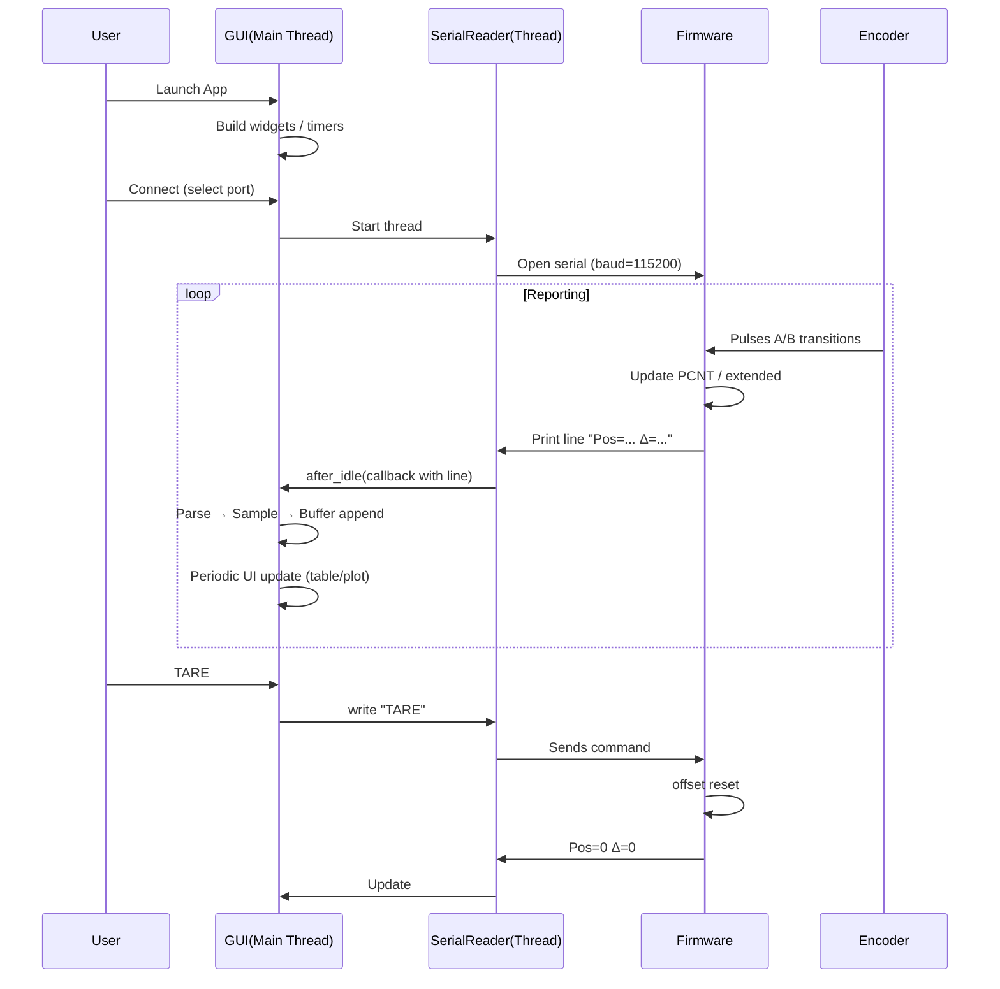

# Πλήρες Ultra-Αναλυτικό Tutorial Αρχιτεκτονικής ESP32 Encoder + Python GUI

Μονοδιάστατο σύστημα ΜΟΝΟ με encoder (χωρίς ενεργό load cell σε αυτό το branch). Όλες οι αναφορές σε **force/weight** είναι ΠΡΟΑΙΡΕΤΙΚΕΣ επεκτάσεις (δεν υπάρχουν ως βασική λειτουργία στο `encoder-only`). Το κείμενο έχει σχεδιαστεί για κάποιον που ξεκινά (beginner → intermediate) και εξελίσσεται σε προχωρημένη κατανόηση (architecture, threading, performance tuning).

---
## Περιεχόμενα
1. Εισαγωγή – Στόχος & Scope
2. High-Level Αρχιτεκτονική (Mermaid & ASCII)
3. Hardware Θεμελίωση (Quadrature, ESP32-S3 PCNT)
4. Λεπτομερής Firmware Δομή (Αρχεία / Ρόλοι)
5. Ροή Εκτέλεσης Firmware (setup/loop, state, APIs)
6. Υπολογισμοί: Pulses → Θέση → Ταχύτητα (Mathematics)
7. Σειριακό Πρωτόκολλο (Σχεδίαση, Kανόνες, Parsing Contracts)
8. Python Εφαρμογή – Modular Αρχιτεκτονική (Layers, Boundaries)
9. Threading & Concurrency Model (Race Conditions, Mutex Strategy)
10. Event Loop & Scheduling (Timers, after, idle callbacks)
11. Data Flow End-to-End (Sequence + Lifetimes + Ownership)
12. Performance Engineering (Latency, Throughput, Memory, Plot Decimation)
13. Reliability & Failure Modes (Fault Tree, Recovery Paths)
14. Testing & Validation Προσεγγίσεις (Unit, Integration, Timing)
15. Επεκτασιμότητα (Velocity, Multi-Encoder, Plugins, Telemetry)
16. Refactoring Roadmap (From Monolith → Clean Architecture)
17. Συχνά Λάθη & Troubleshooting (Εμπλουτισμένο)
18. Security / Robustness Considerations (Input Sanitization κ.λπ.)
19. Glossary (Εμπλουτισμένο)
20. Cheat Sheet (Γρήγορη Αναφορά)

---
## 1. Εισαγωγή – Στόχος & Scope
Αυτό το branch: **encoder-only**. Δηλαδή: *ΜΟΝΟ* καταγραφή και ροή δεδομένων παλμών (pulses) από έναν quadrature encoder → αποστολή μέσω UART/USB → οπτικοποίηση & αποθήκευση σε Python GUI.

Δεν υπάρχει ενσωματωμένος κώδικας ενεργής ανάγνωσης load cell εδώ. Οποιαδήποτε παλαιότερη αναφορά σε Force/Weight είναι σχεδιαστική προοπτική (future extension). Έτσι, το tutorial εδώ:
- Εξηγεί πλήρως την τρέχουσα λειτουργική αλυσίδα.
- Σημειώνει καθαρά τι είναι *optional extension*.
- Δίνει μαθηματικό υπόβαθρο (π.χ. velocity) ακόμα κι αν δεν έχει υλοποιηθεί πλήρως στον παρόντα κώδικα.

### Κεντρικός Στόχος
Χαμηλό latency + σταθερή ροή παλμών με ελάχιστο CPU κόστος → ασφαλής μεταφορά → ομαλή απεικόνιση σε desktop GUI.

### Κύρια Προκλήσεις
| Πρόκληση | Ανάγκη |
|----------|-------|
| Ακριβής μέτρηση παλμών | Hardware counter (PCNT) ή ISR σωστά ρυθμισμένα |
| Ελάχιστο jitter εξόδου | Σταθερό χρονικό reporting interval |
| Επεκτασιμότητα | Καθαρή διαχωρισμένη αρχιτεκτονική modules |
| Thread safety στο host | Σωστή χρήση mutex + GUI main thread κανόνων |
| Απόδοση plotting | Decimation + περιορισμός σημείων |

### Τι Θα Μάθεις
- Πώς χαρτογραφείται ένα φυσικό σήμα σε software layers.
- Πώς σχεδιάζεται ένα απλό αλλά στιβαρό ASCII protocol.
- Πώς οργανώνεται ένα Python real-time GUI χωρίς να μπλοκάρει.
- Πώς εντοπίζεις και αποφεύγεις race conditions.
- Πώς προγραμματίζεις για επεκτασιμότητα (multi-encoder, plugins).

---
## 2. High-Level Αρχιτεκτονική

### 2.1 Mermaid Overview
```mermaid
flowchart LR
    subgraph HW[Hardware]
        ENC[Quadrature Encoder A/B]
    end
    subgraph MCU[ESP32-S3 Firmware]
        PCNT[PCNT Counter / ISR]
        ENCLOGIC[Encoder Logic\n(encoder.cpp)]
        CMDS[Commands Parser\n(commands.cpp)]
        LOOP[Main Loop\n(EncoderReader.ino)]
    end
    subgraph LINK[USB Serial]
        SERIAL[/ASCII Lines/]
    end
    subgraph HOST[Python Host]
        SR[serial_handler.py\n(Thread)]
        PAR[data_parser.py]
        DM[data_models.py\n(Buffer)]
        GUI[encoder_gui.py\n+ gui_components]
        EXP[data_export.py]
    end
    USER((User))

    ENC --> PCNT --> ENCLOGIC --> LOOP --> SERIAL --> SR --> PAR --> DM --> GUI --> USER
    GUI -->|Commands| SR --> CMDS
    DM -->|Export| EXP
```

### 2.2 ASCII Reference
```
Encoder A/B → PCNT → Encoder Logic → (formatted line) → USB CDC → Python Serial Thread → Parser → Buffer → GUI Refresh → Οθόνη χρήστη
```

### 2.3 Layered Responsibilities
| Layer | Ευθύνη | Κανόνας | Κίνδυνος αν σπάσει |
|-------|--------|---------|--------------------|
| Hardware | Παράγει παλμούς | Φυσική ακριβής μετάδοση | Θόρυβος → λάθος pulses |
| PCNT/ISR | Καταγραφή | Χωρίς απώλειες | Overflow / λάθος sign |
| Logic Formatting | Δημιουργεί καθαρή γραμμή | Σταθερό format | Parsing errors |
| Serial Link | Μεταφορά | Χωρίς καθυστέρηση | Disconnection |
| Serial Thread | Ανάγνωση | Non-blocking GUI | Freeze UI |
| Parser | Ταξινόμηση | Ανθεκτικό σε σφάλματα | Crashes / λάθος τιμές |
| Buffer | Αποθήκευση | Thread-safe | Race conditions |
| GUI | Οπτικοποίηση | Μόνο main thread | Exceptions |
| Export | Αρχειοθέτηση | Offline ασφαλές | Corrupt file |

---
## 3. Hardware Θεμελίωση
### 3.1 Quadrature Basics
Ένας quadrature encoder βγάζει δύο τετραγωνικά κύματα (A & B). Η σχετική φάση δίνει κατεύθυνση.

| A | B | Μετάβαση | Ερμηνεία (CW) | Ερμηνεία (CCW) |
|---|---|----------|---------------|----------------|
| 0 | 0 | → 0,1    | +1            | -1 |
| 0 | 1 | → 1,1    | +1            | -1 |
| 1 | 1 | → 1,0    | +1            | -1 |
| 1 | 0 | → 0,0    | +1            | -1 |

### 3.2 PPR vs CPR
- PPR (Pulses Per Revolution): Datasheet output per channel.
- CPR (Counts Per Revolution): Συχνά = 4 * PPR (αν μετράμε κάθε edge δύο καναλιών).

### 3.3 ESP32-S3 PCNT
- Μετρά αλλαγές (edges) σε pin.
- Ρυθμίζουμε up/down ανάλογα με το άλλο κανάλι (ή εφαρμόζουμε λογική σε ISR αν δεν έχουμε native quadrature mode).

### 3.4 Overflow Handling
Αν ο counter είναι 16-bit/32-bit → παρακολούθηση υπερχειλίσεων: αποθηκεύουμε extended count = base + (wraps * RANGE).

### 3.5 Timing Source
Για velocity απαιτείται αξιόπιστο χρονόμετρο (millis() ή high-resolution timer). Για σταθερή αναφορά *report interval*.

---
## 4. Firmware Δομή (Αναλυτικά)
| Αρχείο | Ρόλος | Σχόλια Καλής Πρακτικής |
|--------|------|------------------------|
| `config.h` | Μαζεμένες σταθερές (pins, intervals) | Single source of truth |
| `encoder.h/.cpp` | API: init, read, reset, compute delta | Απόκρυψη hardware λεπτομερειών |
| `commands.h/.cpp` | Parsing "TARE" κτλ | Χρησιμοποίησε state machine αν επεκταθεί |
| `display.cpp` | Optional debugging | Guard με `#ifdef` |
| `EncoderReader.ino` | Orchestration (setup/loop) | Κρατά το loop καθαρό |

### 4.1 API Επιφάνεια `encoder.h`
```c++
void encoder_init();
long long encoder_get_position();
long long encoder_get_delta(); // από τελευταία ανάγνωση
void encoder_tare();           // μηδενίζει offset
```

### 4.2 Internal State Προτεινόμενο
```c++
static volatile int32_t pcnt_raw = 0;     // τρέχων hardware counter
static long long extended = 0;            // extended count 64-bit
static long long last_report = 0;         // προηγούμενη τιμή που αναφέρθηκε
static long long offset = 0;              // για TARE
```

### 4.3 Loop Responsibility Matrix
| Καθήκον | Πρέπει να γίνεται στο loop; | Γιατί |
|---------|-----------------------------|------|
| Ανάγνωση raw counter | Ναι | Συλλογή νέων pulses |
| Υπολογισμός delta | Ναι | Για να τυπώσουμε meaningful γραμμή |
| TARE check | Ναι (command processed) | Ενημέρωση offset |
| Εκτύπωση γραμμής | Ναι (ρυθμισμένο interval) | Ρυθμός εξόδου |
| Δύναμη (force) | Όχι εδώ στο encoder-only | Extension μόνο |

### 4.4 Ροή στο `setup()`
1. Αρχικοποίηση σειριακής: `Serial.begin(115200)`
2. Ρύθμιση PCNT ή pin interrupts για encoder.
3. Μηδενισμός counters.
4. (Αν υπάρχει display) init οθονών.
5. Μήνυμα “READY”.

### 4.5 Ροή στο `loop()` (Λεπτομερής)
Κάθε κύκλο ή ανά χρονικό διάστημα:
1. Διαβάζει τρέχον count από encoder.
2. Υπολογίζει delta = current - previous.
3. Προαιρετικά υπολογίζει γωνία ή velocity (pulses / Δt).
4. Διαβάζει προαιρετικά force (αν ενσωματωθεί sensor).
5. Συνθέτει μία γραμμή κειμένου: `Pos=12345 Δ=12 Force=1.234`.
6. `Serial.println(line)` → στέλνεται στον host.
7. Ελέγχει αν έχει ληφθεί command (Serial.available()) → parse.

### 4.6 Command Handling
- Command: "TARE" → μηδενίζει εσωτερικό offset ώστε `position = 0`.
- Μπορούν να προστεθούν: "RATE?", "PPR?", "RESET".

---
## 5. Υπολογισμοί: Pulses → Θέση → Ταχύτητα
### 5.1 Βασικές Σχέσεις
Αν: `counts` = τρέχουσα cumulative τιμή (με offset), `PPR` = pulses per revolution (per channel), `mode_factor` = 4 (αν full quadrature):
```
CPR = PPR * mode_factor
revolutions = counts / CPR
angle_degrees = revolutions * 360
```

### 5.2 Ταχύτητα
Υπολογισμός βασισμένος σε παράθυρο Δt:
```
delta_counts = counts_now - counts_prev
delta_time_s = (t_now - t_prev) / 1000.0
counts_per_sec = delta_counts / delta_time_s
rpm = (counts_per_sec / CPR) * 60.0
```

### 5.3 Smoothing (Εξομάλυνση)
Εκθετικός Κινούμενος Μέσος (EMA):
```
ema_new = alpha * value + (1 - alpha) * ema_prev
```
Μικρό `alpha` → ομαλό αλλά αργό, μεγάλο `alpha` → γρήγορο αλλά θορυβώδες.

### 5.4 Latency & Resolution Trade-off
| Interval (ms) | Πλεονέκτημα | Μειονέκτημα |
|---------------|-------------|------------|
| 10 | Υψηλή ανάλυση χρόνου | Περισσότερα interrupts/overhead |
| 50 | Ισορροπία | Λίγο θόρυβος στη στιγμιαία ταχύτητα |
| 100 | Χαμηλό CPU | Χαμηλή χρονική ανάλυση |

### 5.5 Anti-Jitter Strategies
1. Time gating: Σταθερό report interval.
2. Median filter σε μικρό history.
3. Θέσε minimum delta threshold (αγνόησε μικρο-σπασμούς).

---
## 6. Σειριακό Πρωτόκολλο (Contract)
### 6.1 Μορφότυπος Γραμμής (Encoder-Only)
```
Pos=<absolute_position> Δ=<delta_counts> [Vel=<counts_per_sec>] [RPM=<rpm>]
```
Τα σε `[]` είναι προαιρετικά extensions (μπορεί να μην υπάρχουν ακόμα).

### 6.2 Αρχές Σχεδιασμού
| Αρχή | Εφαρμογή |
|------|----------|
| Ανθρωπο-αναγνώσιμο | ASCII key=value ζεύγη |
| Επεκτασιμότητα | Προσθήκη πεδίων στο τέλος χωρίς να σπάει parser |
| Ανοχή | Αγνόηση αγνώστων tokens |
| Σταθερότητα | Ο διαχωρισμός γίνεται με space |

### 6.3 Robust Parsing Pattern (Python)
1. Κάνε `.strip().lower()`.
2. Έλεγξε prefix `pos=`.
3. Δίασπασε με space, για κάθε token αν περιέχει `=` → split.
4. Map σε dict, αγνόησε tokens χωρίς `=`.
5. Μετέτρεψε αριθμητικά με `try/except`.

### 6.4 Συμβατότητα Πίσω (Backward)
Ο παλιός κώδικας που ψάχνει μόνο `pos=` + `Δ=` συνεχίζει να λειτουργεί ακόμα αν μπουν νέα στοιχεία.

### 6.5 Παράδειγμα
```
Pos=1200 Δ=24 Vel=4800.0 RPM=750.00
```
Parser αγνοεί `Vel`/`RPM` αν δεν είναι υλοποιημένα στη δομή.

---
## 7. Python Modular Αρχιτεκτονική (Εμβάθυνση)
Φάκελος `python_client` (ή ενσωματωμένο variant στον `EncoderReader`).

| Αρχείο | Ρόλος |
|--------|------|
| `serial_handler.py` | Thread που διαβάζει τη σειριακή πόρτα και στέλνει κάθε γραμμή στον parser callback. |
| `data_parser.py` | Εντοπίζει τι τύπος γραμμής είναι, εξάγει pulses, delta, force. |
| `data_models.py` | Ορίζει `Sample` (dataclass), buffer, thread-safe λογικές αποθήκευσης. |
| `data_export.py` | Εξαγωγή δεδομένων σε Excel (xlsx) ή CSV. |
| `gui_components.py` | Δομικά κομμάτια UI (πλαίσιο, treeview, plot). |
| `encoder_gui.py` | Κύρια κλάση GUI: state, κουμπιά, timers, σύνδεση / αποσύνδεση. |
| `config.py` | Σταθερές, ρυθμίσεις (refresh rate, όρια plot). |

### 7.1 Class Contracts
| Class | Input | Output | Invariants |
|-------|-------|--------|------------|
| SerialReader | port getter, callback | raw line strings | Δεν μπλοκάρει GUI |
| Parser | raw line | dict(fields) | Δεν πετάει uncaught exception |
| DataBuffer | Sample | Stored sequence | Thread-safe append |
| GUI | Buffer snapshot | Rendered table/plot | UI updates μόνο στο main thread |
| Exporter | Buffer snapshot | File (.xlsx) | Ακέραια δεδομένα |

### 7.2 Data Model (Sample)
```python
class Sample:
    t: float        # seconds από την εκκίνηση GUI
    pulses: int     # absolute position
    delta: int      # change since last sample
    # velocity, rpm -> future extension fields
```

### 7.3 Buffer Strategy
Circular vs Linear: Εδώ απλός linear list. Για πολύ μεγάλα runtimes: προτείνεται ring buffer (σταθερή μνήμη).

### 7.4 GUI Responsibilities (Expanded)
| Responsibility | Πώς | Σημείωση |
|----------------|-----|----------|
| Port detection | περιοδικό refresh | Use `after(2000, ...)` |
| Rendering table | incremental insert | Απόφυγε full redraw |
| Plot update | set_data + autoscale | Decimation πριν το set_data |
| Commands | write serial | Validate connection state |
| Export | snapshot + pandas | Μην κρατάς το mutex για πολλή ώρα |

### 7.5 GUI Loop vs Serial Thread (Failure Modes)
| Κακό Σενάριο | Τι Συμβαίνει | Πρόληψη |
|--------------|--------------|---------|
| Direct widget update από thread | Crash / Frozen | Χρήση `root.after_idle` |
| Μεγάλος χρόνος parsing | Καθυστερεί ανάγνωση | Ελαφρύ parsing + offload βαριά εργασία |
| Unbounded buffer growth | Μνήμη εκτοξεύεται | Περιοδικό trimming |

---
## 8. Threading & Concurrency Model
```
[ENCODER HARDWARE]
    │ (ηλεκτρικοί παλμοί)
    ▼
[PCNT / ISR] (Firmware)
    │ position, delta
    ▼
[Serial.println("Pos=... Δ=... Force=...")]
    │ bytes μέσω USB
    ▼
[PC Host Driver]
    │ virtual COM port
    ▼
[SerialReader Thread - Python]
    │ line strings
    ▼
[data_parser.py]
    │ pulses, delta, force
    ▼
[DataBuffer + Sample list]  ← (protected by mutex)
    │ periodic copy (GUI timer)
    ▼
[GUI: Table + Plot]
    │ user interactions
    ▼
[Commands (TARE)] → γράφονται πίσω στη Serial → Firmware εκτελεί → νέα μέτρηση
```

### 8.1 Sequence Diagram (Mermaid)

```
User          GUI(Main)        SerialThread      Firmware(ESP32)     Encoder
 |               |                  |                |                |
 |  Launch app   |                  |                |                |
 |-------------->| build widgets    |                |                |
 |  Select Port  |                  |                |                |
 |-------------->| set var          |                |                |
 |  Connect      |                  |  open port     |                |
 |-------------->| start thread ----|--------------->|   ready        |
 |               |                  |  read lines    |                |
 |               |<-- after(...) ---|                |                |
 |               | update table/plot|                |                |
 |  Click Start  |                  |                |                |
 |-------------->| running=True     |                |                |
 |               |                  |                | read pulses    |<- mechanical rotation
 |               |                  |                | Serial.println |-> "Pos=... Δ=..."
 |               |                  |<---------------|                |
 |               | after_idle(update)                |                |
 |               | update UI                         |                |
 |  TARE         | write("TARE")    |--------------->| reset counter  |
 |-------------->|                  |                |                |
 |  Stop         | running=False    |                | continue idle  |
 |-------------->|                  |                |                |
 | Export        | gather samples   |                |                |
 |-------------->| write Excel      |                |                |
 | Disconnect    | stop thread      | close serial   |                |
 |-------------->|                  |                |                |
```

---
## 9. Data Flow Lifetimes & Ownership
### 9.1 Object Lifetimes
| Object | Δημιουργία | Καταστροφή |
|--------|-----------|------------|
| SerialReader | Connect | Disconnect / Exit |
| Sample | Κατά parsing | Παραμένει μέχρι export ή trim |
| Buffer | App start | App exit |
| GUI widgets | App init | Window close |

### 9.2 Ownership Rules
- Firmware κατέχει τον hardware counter.
- Host κατέχει τα απομονωμένα samples (immutable μετά την προσθήκη).
- GUI δεν τροποποιεί παλιά samples (append-only pattern).

## 10. Event Loop & Scheduling
### 10.1 Timers
- `port_refresh`: κάθε 2s.
- `ui_update`: ~100ms (ρυθμιζόμενο).

### 10.2 Priority
GUI responsiveness > Parsing latency > Export.

### 10.3 Avoiding Starvation
Μη βάζεις blocking I/O στον main thread. Export γίνεται μέσω snapshot.

## 11. Performance Engineering
### 11.1 Latency Targets
| Στάδιο | Στόχος |
|--------|--------|
| Firmware report interval | 20–100 ms |
| Serial delivery | < 5 ms typical |
| Parse + buffer | < 1 ms |
| GUI update | 100 ms cadence |

### 11.2 Plot Decimation Heuristic
```python
if len(data) > 2*MAX_POINTS:
    step = len(data)//TARGET
    decimated = data[::step]
else:
    decimated = data[-MAX_POINTS:]
```

### 11.3 Memory Envelope
`Sample` ~ (timestamp + 2 ints + overhead) ≈ 48–80 bytes (Python object). 100k samples ≈ 5–8 MB.

### 11.4 Scaling Path
| Στόχος | Τεχνική |
|--------|---------|
| >1 encoder | Διαφορετικό prefix (Pos1=, Pos2=) + per-channel buffers |
| High rpm | PCNT wide + overflow extension |
| Analytics | Offload σε δεύτερο processing thread |

## 12. Reliability & Failure Modes
### 12.1 Fault Tree (Partial)
```
Data Corruption
 ├─ Firmware logic bug
 ├─ Serial noise
 ├─ Parser mis-interpretation
 └─ Race condition (missing mutex)
```

### 12.2 Mitigations
| Κίνδυνος | Αντίμετρο |
|----------|-----------|
| Overflow | 64-bit extended count |
| Disconnect | Retry connect / UI disable run |
| Large buffer | Trim oldest N entries |
| Crash parser | try/except + log |

### 12.3 Graceful Shutdown Checklist
1. Set stop event.
2. Join thread (timeout safeguard).
3. Cancel timers.
4. Close serial.
5. Destroy GUI.

## 13. Testing & Validation
| Test | Περιγραφή | Μέθοδος |
|------|-----------|---------|
| Static pulses | Στάση encoder → delta=0 | Παρατήρηση γραμμών |
| Constant rotation | Σταθερή χειροκίνητη κίνηση | Σχεδόν σταθερό delta |
| Rapid spin | Γρήγορη περιστροφή | Δεν χάνονται counts (line continuity) |
| TARE mid-run | Επαναφορά στο 0 | Καμία ασυνέχεια πλην reset |
| Disconnect reconnect | Ελέγχοντας UI state | Δεν crash |

## 14. Επεκτασιμότητα (Paths)
| Feature | Προσέγγιση |
|---------|-----------|
| Velocity live | Προσθήκη πεδίων σε firmware + parser |
| RPM | Παράγωγο από velocity |
| Multi-encoder | Tokenization Pos1= Pos2= |
| JSON protocol | Εναλλακτικό structured mode |
| Plugin filters | Hook μετά append |

## 15. Refactoring Roadmap
1. Extract StateManager στο GUI.
2. Introduce Interface layer για serial (strategy pattern).
3. Add plugin manager.
4. Migrate plotting σε async queue αν φορτώσει.
5. Optional: migrate to asyncio + aio serial.

## 16. Συχνά Λάθη (Εμπλουτισμένο)
| Λάθος | Επιπτώσεις | Διόρθωση |
|-------|------------|----------|
| Απουσία mutex | Race / corrupted list | Χρήση Lock γύρω από append |
| Υπερβολικό redraw | CPU spike | Incremental updates |
| Σειρά tokens αλλάζει | Parser fails | Flexible token map |
| Hard-coded COM name | Μη φορητό | Δυναμικό scan |

## 17. Security / Robustness
| Απειλή | Μέτρο |
|--------|-------|
| Κακόβουλη γραμμή | Validate numeric conversions |
| Resource leak | use `with serial` ή proper close |
| Large file export | Progress + cancellation (future) |

## 18. Glossary (Εμπλουτισμένο)
- **CPR**: Counts per revolution (με quadrature factor).
- **ISR**: Interrupt Service Routine.
- **Latency**: Χρόνος μεταξύ φυσικού γεγονότος & GUI εμφάνισης.
- **Throughput**: Δείγματα ανά δευτερόλεπτο.
- **Backpressure**: Όταν downstream (GUI) δεν προλαβαίνει upstream ροή.

## 19. Cheat Sheet (Ενημερωμένο)
| Task | Firmware | Host |
|------|----------|------|
| Reset position | `encoder_tare()` | Send `TARE` |
| Read position | read PCNT + extend | Parse `Pos=` |
| Add velocity | compute Δ/Δt | add columns |
| Add export | n/a | run exporter |
| Handle disconnect | detect serial fail | disable buttons |

## 20. Τελική Σύνοψη
Μια καθαρή αλυσίδα: **Physical pulses → Deterministic counting → Structured ASCII lines → Thread-safe parsing → Buffered visualization → Optional analytics/export**.

Η τωρινή μορφή είναι ελαφριά, επεκτάσιμη και ιδανική βάση για πρόσθετες λειτουργίες (velocity, multi-channel, plugins). Ο διαχωρισμός layer μάς επιτρέπει να εξελίξουμε κάθε κομμάτι ανεξάρτητα.

Καλή συνέχεια στη μελέτη και στις επεκτάσεις! 🚀
### 9.1 Σενάριο: Πρώτη Εκκίνηση
1. Συνδέω ESP32 με USB.
2. Ανοίγω Python GUI.
3. Στο dropdown COM επιλέγω τη θύρα.
4. Πατάω Connect → ανοίγει serial thread.
5. Πατάω Start → αρχίζει συλλογή.
6. Περιστρέφω τον άξονα → pulses αυξάνονται.
7. Τα δεδομένα εμφανίζονται σε πίνακα & plot.

### 9.2 Σενάριο: TARE (Μηδενισμός)
1. Άξονας σε επιθυμητή θέση αναφοράς.
2. Πατάω TARE → στέλνεται "TARE".
3. Firmware θέτει internal offset.
4. Επόμενη γραμμή `Pos=0`.

### 9.3 Σενάριο: Force Lines
1. Αν firmware ή δεύτερο σύστημα στέλνει `Force=1.234`.
2. Serial thread το λαμβάνει.
3. Parser ενημερώνει `current_force`.
4. Επόμενες encoder γραμμές μπορούν να συνδυαστούν με την τελευταία τιμή force.

### 9.4 Σενάριο: Export
1. Πατάω Export.
2. GUI παίρνει αντίγραφο των samples (με mutex).
3. Δημιουργεί DataFrame → .xlsx.
4. Εμφανίζεται μήνυμα επιτυχίας.

---
## 10. Διαχείριση Απόδοσης (Performance)
| Σημείο | Βελτίωση |
|--------|----------|
| PCNT Hardware | Μειώνει CPU load σε υψηλά RPM. |
| Decimation Plot | Περιορίζει σημεία (π.χ. 4000) για ομαλό redraw. |
| Mutex + Copy | GUI δεν μπλοκάρει το serial thread. |
| Χρήση after() | Αποφυγή blocking στον κύριο βρόχο Tkinter. |
| Απλό Protocol | Ελάχιστη CPU κατανάλωση στο parsing. |

### 10.1 Memory Strategy
- Buffer κρατά λίστα δειγμάτων.
- Εάν γίνει πολύ μεγάλη: μπορείς να εφαρμόσεις pruning (π.χ. διαγράφεις παλιά).

---
## 11. Αντιμετώπιση Σφαλμάτων & Αξιοπιστία
| Πρόβλημα | Αίτιο | Λύση |
|----------|-------|------|
| Δεν εμφανίζονται pulses | Λάθος COM port ή δεν τρέχει firmware | Έλεγξε `Serial Monitor` με άλλο εργαλείο. |
| Random disconnect | Καλώδιο USB/ισχύς | Άλλαξε καλώδιο, έλεγξε drivers. |
| Force δεν ενημερώνεται | Δεν στέλνονται γραμμές Force= | Έλεγξε firmware ή δεύτερη πηγή. |
| Plot "πηδά" | Απότομες τιμές ή μηδενισμός (TARE) | Αναμενόμενο. |
| Export αποτυγχάνει | Αρχείο ανοιχτό σε Excel | Κλείσε το αρχείο & ξανά. |

### 11.1 Ασφαλές Κλείσιμο
- Πατάω Disconnect ή κλείνω το παράθυρο.
- Serial thread: stop event → join.
- Αποφυγή εξαιρέσεων Tkinter.

---
## 12. Επεκτασιμότητα & Πώς Προσθέτω Νέα Λειτουργία
### 12.1 Προσθήκη Velocity στο Firmware
1. Υπολογίζεις delta/Δt.
2. Προσθέτεις στο print: `Vel=xxx`.
3. Στο Python parser: νέο key extraction.
4. Στο Sample: προσθήκη πεδίου (π.χ. `velocity`).
5. Επέκταση plot δεύτερης καμπύλης.

### 12.2 Νέα Εντολή (π.χ. SET_PPR 1024)
1. Firmware `commands.cpp`: parse → αλλάζει global ppr.
2. Αποστολή επιβεβαίωσης "OK".
3. Python: κουμπί που στέλνει `SET_PPR 1024\n`.

### 12.3 Plugin Pattern (π.χ. Αλγόριθμος Φιλτραρίσματος)
1. Νέο αρχείο `filter_plugin.py`.
2. Hook: μετά από προσθήκη sample.
3. GUI plugin manager το φορτώνει.

---
## 13. Συχνά Λάθη & Troubleshooting
| Λάθος | Εξήγηση |
|-------|----------|
| Αρχάριος μπλοκάρει GUI με time.sleep | Πρέπει να χρησιμοποιεί `after()` |
| Προσπάθεια ενημέρωσης widget από serial thread | Tkinter δεν είναι thread-safe |
| Λανθασμένο parsing (lowercase vs uppercase) | Κάνουμε `.lower()` πριν έλεγχο |
| Μηδενισμός ενώ συλλέγει → απότομο γράφημα | Είναι φυσιολογικό (restart baseline) |

---
## 14. Λεξικό Όρων (Glossary)
- **Pulses**: Αύξηση/μείωση με κάθε βήμα encoder.
- **Delta**: Διαφορά παλμών από προηγούμενη μέτρηση.
- **Velocity**: Ρυθμός μεταβολής pulses/χρόνο.
- **RPM**: Περιστροφές ανά λεπτό.
- **PCNT**: Pulse Counter hardware μονάδα ESP32.
- **TARE**: Μηδενισμός τρέχουσας θέσης (reset offset).
- **Thread**: Παράλληλη διεργασία μέσα στο πρόγραμμα.
- **Mutex**: Μηχανισμός για αμοιβαίο αποκλεισμό (ασφάλεια δεδομένων). 
- **Decimation**: Δειγματοληψία κάθε Νου δείγματος για μείωση φόρτου.
- **Callback**: Συνάρτηση που καλείται όταν συμβεί γεγονός.

---
## 15. Γρήγορος Πίνακας Αναφοράς (Cheat Sheet)
| Ενέργεια | Τι κάνω | Τι συμβαίνει μέσα |
|----------|---------|--------------------|
| Εκκίνηση | Ανοίγω GUI | Φορτώνει widgets, timers |
| Επιλογή COM | Dropdown | Επιλογή θύρας για serial thread |
| Connect | Κουμπί | Ανοίγει θύρα, ξεκινά thread ανάγνωσης |
| Start | Κουμπί | `running=True`, αρχίζει καταγραφή δειγμάτων |
| Περιστροφή | Κίνηση άξονα | Firmware στέλνει `Pos=` γραμμές |
| TARE | Κουμπί | Αποστολή "TARE" → Firmware μηδενίζει offset |
| Force Update | Κατά την είσοδο | Parser αποθηκεύει current_force |
| Export | Κουμπί | Αντιγραφή buffer → Excel αρχείο |
| Disconnect | Κουμπί | Stop event → thread join |
| Exit | Κλείσιμο παραθύρου | Stop timers + thread + destroy |

---
## Τελική Σύνοψη
Από τον encoder μέχρι το Excel αρχείο, η αρχιτεκτονική βασίζεται σε καθαρές στρώσεις:
1. Hardware → firmware με PCNT/ISR.
2. Firmware → απλό, επεκτάσιμο πρωτόκολλο ASCII.
3. Python → modular (serial, parsing, data model, GUI, export).
4. Threading → ένας background αναγνώστης, GUI main loop, ασφαλής μεταφορά δεδομένων.
5. Visualization & Export → άμεση πληροφόρηση + ανάλυση offline.

Με την κατανόηση αυτής της ροής, μπορείς εύκολα:
- Να προσθέσεις νέα πεδία (π.χ. θερμοκρασία).
- Να αλλάξεις ρυθμούς ανανέωσης.
- Να βελτιώσεις φίλτρα/υπολογισμούς.
- Να μεταφέρεις την ίδια ιδέα σε άλλα αισθητήρια.

Καλή μελέτη & εξερεύνηση! 🚀
