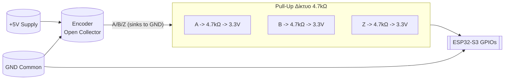

# Καθαρό Διάγραμμα Σύνδεσης Encoder (Omron E6B2-CWZ6C) με ESP32-S3 (Encoder-Only Branch)

> Εστίαση: ΜΟΝΟ παλμοί A/B (+ προαιρετικά Z). Χωρίς force / load cell. Open Collector (NPN) έκδοση encoder με εξωτερικά pull‑ups στα 3.3 V.

---
## 0. Ultra-Clear Direct Wiring (Οπτική από ESP32 προς Encoder)

Πρώτα βλέπουμε τι βγαίνει από το ESP32 και πώς «συναντά» τον encoder.

### 0.1 Σύνοψη Συνδέσεων (ESP32 πλευρά → Encoder πλευρά)
```
ESP32 3.3V ── R_A (4.7kΩ) ─┐                 ┌─> (Transistor A μέσα στον encoder) ──> GND
ESP32 GPIO16 <─────────────┘  (Σημείο A)

ESP32 3.3V ── R_B (4.7kΩ) ─┐                 ┌─> (Transistor B μέσα στον encoder) ──> GND
ESP32 GPIO17 <─────────────┘  (Σημείο B)

ESP32 3.3V ── R_Z (4.7kΩ) ─┐                 ┌─> (Transistor Z μέσα στον encoder) ──> GND (OPTIONAL)
ESP32 GPIO18 <─────────────┘  (Σημείο Z)

ESP32 GND ──────────────────────────────────────> Blue (GND Encoder)
ESP32 5V  ──────────────────────────────────────> Brown (Vcc Encoder 5V)
Shield (αν υπάρχει) ───────────────────────────> GND ΜΟΝΟ στην πλευρά ESP32
```

### 0.2 Micro–Schematic Ανά Κανάλι (Open Collector NPN)
```
    3.3V
     │
    4.7kΩ (R_A)
     │ (Σημείο A)───────────> GPIO16 (εισόδος ESP32)
     │
   ┌─────┴─────┐
   │ Encoder A │  (εσωτερικό NPN transistor τραβά το σημείο A στο GND όταν ενεργοποιείται)
   └─────┬─────┘
     │
    GND

Επαναλάβετε ίδιο για B (GPIO17) και προαιρετικά Z (GPIO18)
```

### 0.3 Γιατί Δεν Πάμε 5V Στα GPIO
Ο encoder τροφοδοτείται με 5 V (Brown), αλλά τα κανάλια A/B/Z (open collector) ΔΕΝ “σπρώχνουν” τάση – απλά βυθίζουν σε GND. Άρα εμείς αποφασίζουμε το λογικό HIGH μέσω pull‑up στην **ασφαλή** τάση 3.3 V του ESP32.

---

## 1. Πίνακας Καλωδίων
| Σύρμα Encoder | Σήμα | Περιγραφή | Σύνδεση |
|---------------|------|-----------|---------|
| Brown         | Vcc  | Τροφοδοσία encoder (5 V τυπικά) | +5V (ESP32 5V pin / σταθερό 5V) |
| Blue          | GND  | Γείωση | GND ESP32 (κοινή) |
| Black         | A    | Κανάλι A (open collector) | GPIO16 μέσω pull‑up 4.7 kΩ σε 3.3 V |
| White         | B    | Κανάλι B (open collector) | GPIO17 μέσω pull‑up 4.7 kΩ σε 3.3 V |
| Orange (opt.) | Z    | Index / zero pulse (προαιρετικό) | GPIO18 μέσω pull‑up 4.7 kΩ σε 3.3 V |
| Shield (opt.) | SHLD | Θωράκιση καλωδίου | Στη γείωση ΜΟΝΟ στην πλευρά ESP32 (ή chassis) |

## 2. Απλό Μπλοκ Διάγραμμα (Γενική Εικόνα)
```
    +5V  (τροφοδοσία encoder)
     │
     │   Brown
 ┌───────────┐
 │  ENCODER  │  Black (A) ──┬─── R1 (4.7kΩ) ──┐
 │  Omron    │              │                 │ 3.3V
 │  E6B2     │  White (B) ──┬─── R2 (4.7kΩ) ──┤
 │           │              │                 │
 │           │  Orange (Z) ─┬─── R3 (4.7kΩ) ──┤ (optional)
 │           │              │                 │
 │           │  Blue  (GND) ────────────────┐ │
 └───────────┘                              │ │
        ▲                                   │ │
        │                                   │ │
        └──────── Shield (μονοπλευρική) ────┘ │
                                             │
       A signal after pull‑up  ───────────── GPIO16 (ESP32)
       B signal after pull‑up  ───────────── GPIO17 (ESP32)
       Z signal after pull‑up  ───────────── GPIO18 (ESP32, optional)
       Common GND ───────────────────────── GND (ESP32)
```

## 3. Mermaid Flow (Λογικό Επίπεδο Σήματος)


## 4. Minimal Schematic Style (ASCII) (Εναλλακτική Όψη)
```
          +5V
           │
        Brown
           │
      ┌────────┐
      │Encoder │
      │  OC NPN│
      └┬─┬─┬───┘
       │ │ │
       │ │ │Orange (Z) (opt)
       │ │ White (B)
       │ Black (A)
       │ │ │
       ├─┴─┼────────────────────── GND (Blue)
       │   │
       R1  R2  R3 (optional)
       │   │   │
      3.3V 3.3V 3.3V
       │   │   │
       │   │   │
      GPIO16  GPIO17  GPIO18(optional)
```

## 5. Επιλογή Αντιστάσεων
| Τιμή | Πλεονέκτημα | Σχόλιο |
|------|-------------|--------|
| 10 kΩ | Μικρό ρεύμα | Πιο αργά μέτωπα σε υψηλό RPM |
| 4.7 kΩ | Ισορροπία | Προτεινόμενη default |
| 2.2 kΩ | Καθαρότερες ακμές | Μεγαλύτερο ρεύμα → θερμικό/κατανάλωση |

## 6. Έλεγχος Τύπου Εξόδου
1. Αποσύνδεσε pull‑ups, τροφοδότησε encoder.
2. Μέτρησε Black ως προς GND:
   - Αν “αιωρείται” → open collector (χρειάζονται pull‑ups).
   - Αν εναλλάσσεται καθαρά 0↔5 V → push‑pull → ΧΡΕΙΑΖΕΣΑΙ level shifting.

## 7. Push-Pull (TTL) Παραλλαγή (Αν βρεθεί διαφορετικός encoder)
| Κανάλι | Λύση Level Shift απλή | Σημείωση |
|--------|-----------------------|----------|
| A/B/Z  | Διαιρέτης: 10 kΩ (επάνω) + 15 kΩ (κάτω) → ~3.0 V | Κάθε γραμμή ξεχωριστά |
|        | Ή 74LVC245 τροφοδοτούμενο στα 3.3 V | Buffer IC |

## 8. Checklist (Γέμισε τα κουτάκια κατά την εγκατάσταση)
- [ ] Κοινή Γείωση
- [ ] Pull‑ups 4.7 kΩ σε 3.3 V (A,B, (Z))
- [ ] Καμία απευθείας 5 V έξοδος στο GPIO
- [ ] A → GPIO16 / B → GPIO17 / (Z → GPIO18)
- [ ] Shield γειωμένο μονοπλευρικά
- [ ] Έλεγχος κατεύθυνσης (CW αυξάνει counts)

## 9. Γρήγορη Επαλήθευση με Firmware
Μετά το flash:
1. Ανοίγεις Serial Monitor.
2. Περιστρέφεις πολύ αργά CW → `Pos` πρέπει να αυξάνει.
3. Περιστροφή CCW → `Pos` μειώνεται.
4. Σταθερό encoder → `Δ=0`.

## 10. Συνοπτική Σύνοψη
- Ο encoder τροφοδοτείται με 5 V.
- Τα σήματα είναι open collector → χρειάζονται pull‑ups σε **3.3 V** (ΟΧΙ 5 V) πριν μπουν στο ESP32.
- Επιλεγμένα GPIO: 16 (A), 17 (B), 18 (Z προαιρετικό).
- Διατήρησε καθαρή γείωση & σωστή θωράκιση αν το καλώδιο είναι μακρύ.

Καθαρό, απλό, επεκτάσιμο. Έτοιμο για χρήση.
